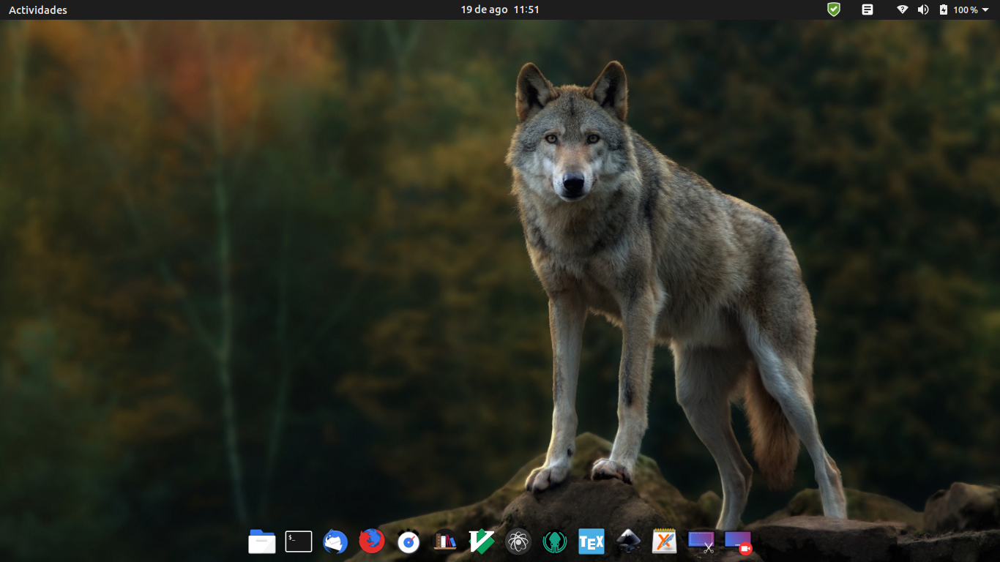

# My linux configuration


Welcome to my `Linux Configuration`. This repo holds not only different useful
shell scripts but also wallpapers, themes, color schemes... All together, they
enable me to work in a simple, fast and personal way. 

```shell
echo 'Welcome to LinuxConf'
```

## Wolf based theme

Wolfs are my favourite animals, that is the reason behind wallpapers selection.
Colorful ones are for main desktop while the black acts as background for your
preferred terminal emulator:




## Elegant theme, icons and desktop bar

By making use of `Marwaita Osx Dark` theme in combination with `Flat Remix Icons`
and `Plank` it os possible to finally get a beautifull environment:

## How to recreate this environment

In order to get all this configuration in your local machine, please follow the
next steps:

1. Download or directly clone this repository.
2. Run the install.sh shell script to install different applications.
3. Create a `.themes` and `.icons` folder in your `home/user_name`.
4. Unzip themes and icons in previous corresponding folders.
5. Enjoy!
